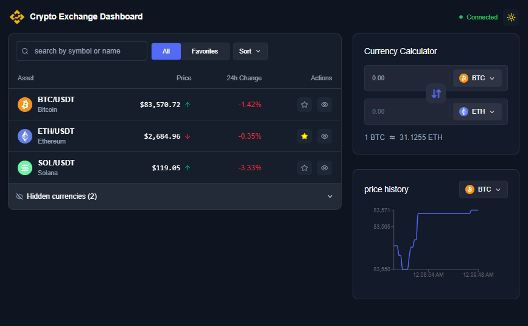

# Crypto Exchange Dashboard

A responsive dashboard for viewing live cryptocurrency prices and converting between currencies.

Live demo: [Open the site](https://crypto-exchange-dashboard-three.vercel.app/)

## preview



##


## Installation

Requirements: Node.js and npm.

```bash
git clone https://github.com/Ani-Gamtsemlidze/crypto-exchange-dashboard.git
cd crypto-exchange-dashboard
npm install
```

## Running the project

```bash
npm run dev
```

Other commands:

```bash
npm run build       # TypeScript check and production build
npm run lint        # ESLint
npm run format      # Format project files with Prettier
npx vitest run      # Unit tests
```

Open the URL shown in the terminal: `http://localhost:5173` (default Vite port).

No API key is needed: it uses Binance's public WebSocket stream.

## Libraries used

- **React** + **TypeScript**: UI and type safety
- **Vite**: build tool and dev server
- **Tailwind CSS**: styling
- **Recharts**: price history chart
- **Sonner**: toast notifications for price alerts
- **Radix UI**: accessible dropdowns and popovers
- **vitest**: unit tests for calculator and percentage-change logic
- **lucide-react**: icons

## Project architecture

- `components/` contains the header, market UI, calculator, chart, and shared interface elements.
- `hooks/` manages live Binance prices, alerts, session price history, and browser storage.
- `constants/` defines the supported cryptocurrency pairs.
- `types/` contains shared TypeScript types.
- `utils/` contains calculation and formatting functions, including the logic covered by unit tests.

`App` receives live market prices from `useBinancePrice` and passes them to the market, calculator, and chart UI.

## Features

- Live market prices, 24-hour percentage changes, and price direction
- Search by currency name or symbol; sort by name, price, or price change
- Favorites and a separate list for hidden currencies
- Currency calculator with input validation and a currency swap button
- A 2% price-change alert based on the first price received during the session
- A selectable price history chart using data collected during the current session
- Connection, loading, error, and empty-result states
- Responsive layout and light/dark theme

## Technical decisions and assumptions

- Prices come from Binance's public WebSocket API. The app has no backend or database.
- Currency conversion uses the latest available USDT prices. Swapping exchanges the selected currencies while keeping the entered amount in the first input; the converted amount is read-only and is also shown as an estimated result.
- The market's 24-hour change comes from Binance ticker data. The 2% alert compares the current price with the first price received after the page opens. It does not repeat while the change remains beyond 2%; it can appear again after the change drops below 2% and later crosses the threshold again.
- The header shows the WebSocket connection status. After an unexpected close, the app retries every 5 seconds for up to 5 reconnection attempts. When the browser comes back online, it attempts to connect again.
- Favorites, hidden currencies, and the theme preference are stored in localStorage. Chart history stays in memory and resets on refresh.
- The dashboard has one page, so it does not use client-side routing.
